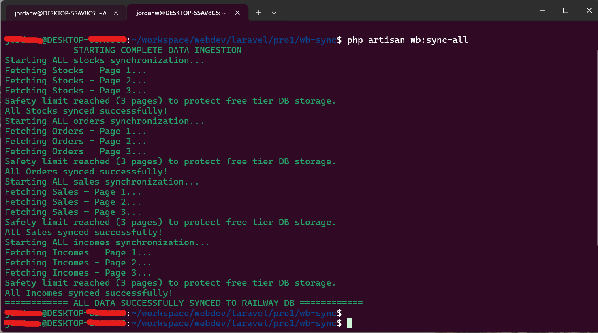

# Wildberries Data Ingestion Service


## Приветствие / Краткое руководство (Quick Start)

Здравствуйте! Этот проект был разработан с целью продемонстрировать интеграцию с API Wildberries, обработку пагинации и безопасное сохранение данных в удаленной базе данных MySQL (Railway). 

### Быстрый запуск для тестирования:
Чтобы запустить полную синхронизацию всех 4 эндпоинтов одновременно, выполните команду:
```bash
php artisan wb:sync-all

```

*Для очистки таблиц и сброса объема хранилища в целях тестирования вы можете запустить:* `php artisan wb:clear-all`


## Technical Overview

This Laravel 11 application automates analytical data extraction from 4 core Wildberries endpoints (Stocks, Orders, Sales, and Incomes) and pushes them to a remote cloud MySQL cluster.

## Image Demo

<p align="center">
    
</p>

### Key Architectural Highlights:

1. **Data Idempotency:** Implemented robust `updateOrCreate()` locks driven by business natural keys to prevent row duplication on multiple job executions.
2. **Defensive Ingestion:** The mock API server naturally generates inconsistent/corrupted values (such as negative IDs `-83054245` for strict positive fields like `nm_id` and `barcode`). All critical primary/foreign mappings were configured as `string` types to shield the database against query boundaries exceptions.
3. **Storage Smart Guard:** To protect the free-tier cloud database allocation limit (5MB), a safety brake caps the automatic loop pagination to a maximum of **3 pages** per command, safely populating ~100 heavy rows to validate performance without memory overflow.


## Remote Database Credentials (Railway)

For direct evaluation and structural inspection, you can connect to the live production database using the environment variables below:

* **DB_CONNECTION:** `mysql`
* **DB_HOST:** `cela.proxy.rlwy.net`
* **DB_PORT:** `31028`
* **DB_DATABASE:** `railway`
* **DB_USERNAME:** `root`
* **DB_PASSWORD:** `mITLLyhKsdKPfNfnAoEXRSEuzBbYPOsA`


## Available Artisan Commands

### The Master Command

Runs all sync routines sequentially managing pagination cursors:

```bash
php artisan wb:sync-all
```

### Granular Commands

If you need to trigger or debug independent pipelines:

```bash
php artisan wb:sync-stocks   # Current live stock inventory status
php artisan wb:sync-orders   # Historical purchase orders
php artisan wb:sync-sales    # Financial and transactional sales data
php artisan wb:sync-incomes  # Inbound supplier warehouse deliveries
```

### Database Maintenance

Resets internal synchronized tables counters and clears data rows to free up cluster storage:

```bash
php artisan wb:clear-all
```

## Разработчик / Developer

Если у вас возникнут вопросы по работе скрипта или конфигурации, пожалуйста, свяжитесь со мной.
*If you have any questions regarding the script execution or architecture configuration, feel free to reach out!*

**Jordan Willian**
* **Email:** [jordan.willian.mp@gmail.com](mailto:jordan.willian.mp@gmail.com)
* **Telegram:** [@jordanWillianMP](https://t.me/jordanWillianMP)